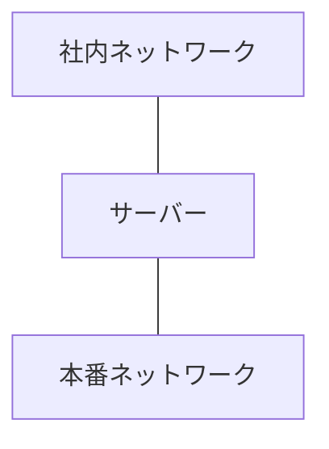
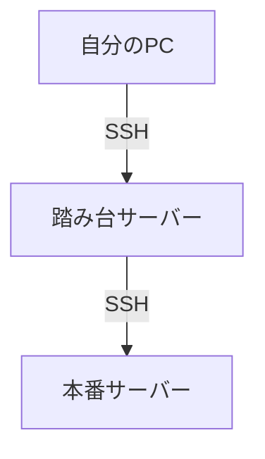
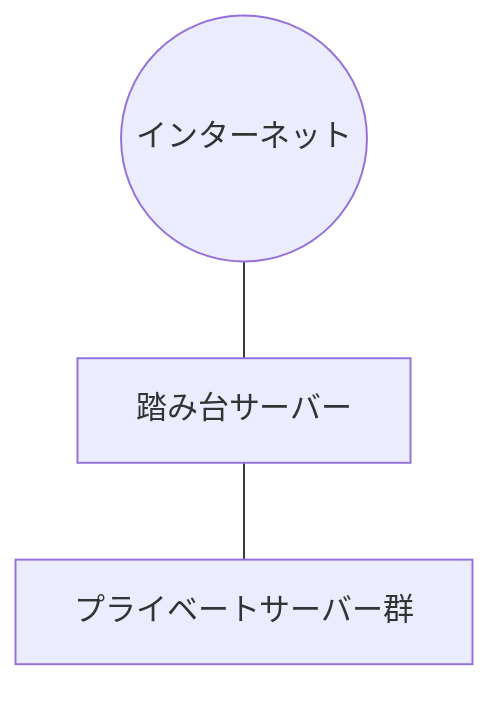

# 1台のサーバーで2つのネットワークをつなぐ仕組み  
## 〜踏み台サーバーの考え方をやさしく理解する〜

---

## 結論（3行サマリ）

- 1台のサーバーは、2つのネットワークに同時に参加できる  
- そのサーバーが「橋渡し役」になる  
- これが踏み台サーバーの基本構造である  

---

## 1. ネットワークは普通「分断」されている

例えば、こんな構成を考えます。

**社内ネットワーク**  
192.168.1.0/24  

と  

**本番ネットワーク**  
10.0.0.0/24  

この2つは別のネットワークです。

社内PC（192.168.1.50）から  
本番サーバー（10.0.0.10）へは、通常は直接アクセスできません。

なぜなら、

> **別のネットワーク（サブネット）同士は、そのままでは通信できない**
というルールがあるからです。

* 正確にはルーティング（経路）がなければ通信できないになります。
（サブネットの記事は別で説明）

---

## 2. ではどうやって接続するのか？

ここで登場するのが「2つのネットワークに接続できるサーバー」です。

このサーバーは、
- 社内ネットワーク側にも  
- 本番ネットワーク側にも  

つながっています。

つまり、両方の世界を知っている存在になります。

---

## 3. なぜ1台で両方につながれるのか？

IPアドレスは「1台のPCに1つだけ付く」と学んだ人も多いかもしれません。  
しかし、実際は少し違います。

IPアドレスは「PCそのもの」ではなく、**ネットワークの接続口（インターフェース）** に付与されます。

例えば、有線LANと無線LANを持つPCでは、

- 有線LAN：10.0.0.10  
- 無線LAN：192.168.1.50  

のように、接続口ごとに別のIPアドレスを持てます。

この接続口を **NIC（Network Interface Card）** と呼びます。

サーバーはこのNICを複数持てるため、

- NIC① → 社内ネットワーク  
- NIC② → 本番ネットワーク  

のように、1台で複数のネットワークに同時参加できます。

> IPアドレスは「機械」ではなく「接続口」に付く。  
> だから接続口が複数あれば、複数ネットワークに属せる。

これが、1台で2つのネットワークをつなげられる理由です。

---

## 4. これが踏み台サーバー

2つのネットワークに接続されたサーバーを中継役として使います。

- まず踏み台に接続する  
- そこから本番サーバーへ接続する  

この中継役が **踏み台サーバー（Bastion）** です。

## 5. なぜこんな面倒なことをするのか？

理由は **セキュリティ** と **ネットワーク帯域の確保** です。

---

### ■ セキュリティ上の理由

もし本番サーバーを社内ネットワークから直接見えるようにすると、次のような問題が起きます。

- 攻撃対象が増える  
- アクセス制御が複雑になる  
- ログ管理が難しくなる  
- マルウェア感染時に被害が一気に広がる  

そこで、

- 本番ネットワークは閉じる  
- 外部からは踏み台サーバーにしか入れない  

という構造にします。

つまり踏み台は、

> **セキュリティの関所（ゲート）**

の役割を持っています。

---

### ■ ネットワーク帯域を守るため

もう一つ重要なのが **帯域（回線の太さ）を守ること** です。

例えば本番システム内で、

本番サーバーからNASへ  
大容量のバックアップデータを転送する処理があったとします。

これを社内ネットワークと同じセグメントで流すと、

- 社内PCの通信が遅くなる  
- 業務アプリが重くなる  
- Web会議が不安定になる  

といった問題が起きます。

---

## ■ ネットワーク分離のメリット

本番ネットワークを分離しておくことで：

- 社内ネットワークの帯域を圧迫しない  
- 本番系の大量通信を隔離できる  
- 障害の影響範囲を限定できる  
- トラフィック制御がしやすい  

というメリットがあります。

---

## 6. これはクラウドでも同じ

クラウドでも構造は同じです。

- 外部に公開されているのは踏み台だけ  
- 本番環境は非公開ネットワーク  

この設計は、非常に一般的です。

---

## 7. 本質は「境界を作る」こと

- ネットワークを分ける  
- 境界を作る  
- 境界に中継役を置く  

これがインフラ設計の基本思想です。

---

## まとめ

1台のサーバーが2つのネットワークに接続できる理由は、

> **ネットワーク接続口（NIC）が複数あるから**

です。

そしてその構造を使うことで、

- ネットワークを安全に分離できる  
- セキュアなアクセス経路を作れる  
- 踏み台サーバーを構成できる  

ネットワーク設計が理解できる人は、

> 「どこが境界で、誰が橋渡しをしているか」

を常に意識しています。

それが分かると、インフラの見え方が一段深くなります。