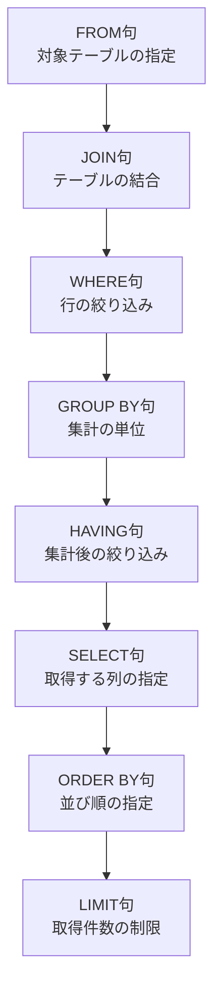

# Python慣れエンジニアが最初に躓くSQLの順序と解き方

## ✅ この記事の結論
- SQLは手続き型ではなく**宣言型**である  
- 実際に処理される順序は句（FROM, JOIN, WHERE…）で決まっている  

---

## 導入：Python感覚でSQLを書こうとしてハマる人へ

Pythonのpandasに慣れていると、つい「どう処理するか」を順番に考えがちです。  
1行で終わる集計処理でも、SQLだとサブクエリやGROUP BYで長くなり、こんな気持ちになります：

> 「え、SELECTする前にWHEREで絞り込まれてるの!?」  

この記事では、**SQLの処理順序の基本**を図解で理解し、スッキリ書くコツを紹介します。

## サンプルテーブル

この記事では、以下の `users` テーブルを例に使います。

| id | name    | age | city      |
|----|---------|-----|-----------|
| 1  | Alice   | 25  | Tokyo     |
| 2  | Bob     | 19  | Osaka     |
| 3  | Charlie | 30  | Tokyo     |
| 4  | Dave    | 22  | Osaka     |
| 5  | Eve     | 18  | Osaka     |

---

###  集計したい内容
「20歳より上で絞り込んで、都市ごとにユーザー数を集計する」

## pandasに慣れているとつい手続き型で書いてしまう

Pythonの`pandas`に慣れていると、処理をステップごとに書きがちです。

```python
# pandas的な書き方（手続き型）
user_df = user_df[user_df['age'] > 20] # 20歳以上にフィルタ
user_df = user_df.groupby('city').size() # カウント
user_df
```

これをそのままSQLで書くと、こんな感じになりがちです。

```sql
SELECT 
    city,
    COUNT(*) as count
FROM (
    SELECT * 
    FROM users
    WHERE age > 20                     
) AS filtered_users
GROUP BY city
```

- 1行の処理がサブクエリで3行増える
- 「SQLめんどくさい…」と感じるポイント

でも、これは書き方の問題です。SQLの本質を理解すればスッキリ書けます。

## SQLは宣言型
SQLは 「どう処理するか」ではなく「何を取得したいか」を宣言する言語 です。

- 完成形（結果のイメージ）をサーバーに渡す
- サーバーが最適な実行順序を決めて処理してくれる

## SQLの実行順序（句の順番）

SQLは書いた順に処理されるわけではありません。

実際に処理される順序は以下の通りです：



つまり、**「集計」の前に、「行の絞り込み」は終わっている**ことになります。

例：先ほどのSQLをシンプルに書くと

```sql
SELECT 
    city, 
    COUNT(*) as count
FROM users
WHERE age > 20
GROUP BY city
```

- 余計なサブクエリなし
- SQLの宣言型の本質を活かしたスッキリ構文


## まとめ

SQLは「完成図を宣言する」ことが本質
サブクエリを使わなくても、SQLは宣言型なので処理順序を理解していればOKです!
実行順序を理解すると、デバッグや複雑なクエリ作成がぐっとラクになる

サブクエリやWITH句を使う場合もありますが、まずはシンプルに書ける宣言型の感覚を持つことが大事

## 💡 補足
- pandas流で手続き型に慣れていると、「処理の順番」を考えがち
- SQLでは「何を取得したいか」を意識するだけでスッキリ書ける
- 実務でも可読性と保守性が格段に上がる